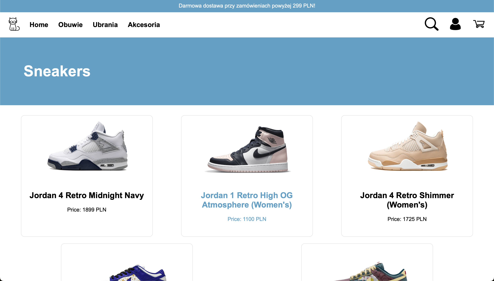
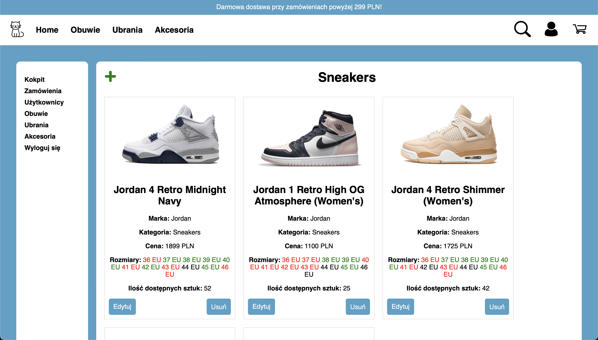
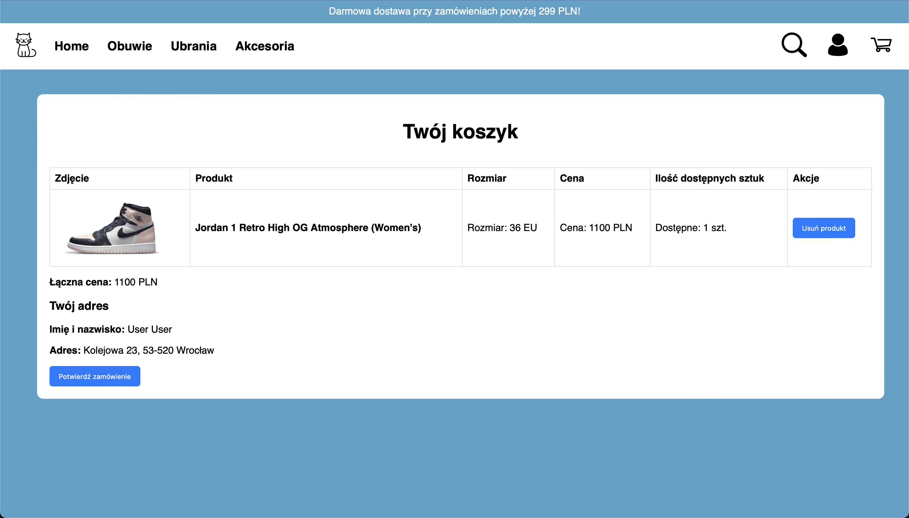
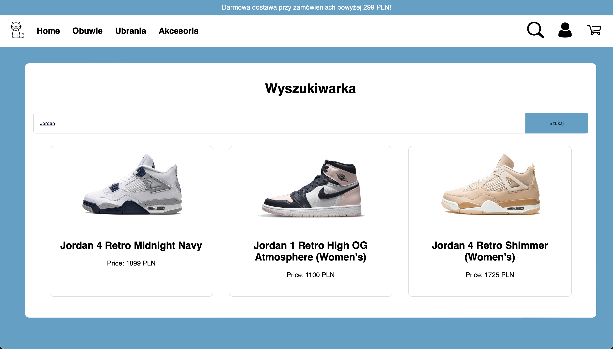

# Sneaker Store

## General Information

The Streetwear Store project is a classic web application built with Node.js and the Express framework. It implements the functionality of an online store offering a wide range of sneakers, clothing, and limited accessories. The application relies solely on MongoDB as its database solution.

## Technologies and Tools:

* Node.js
* Express.js
* MongoDB
* HTML/CSS/JavaScript (front-end)
* bcrypt (for secure password hashing)

## Interface

## Functionalities:

### Anonymous User:

* Browsing the store's content, including sneakers, clothing, and accessories.
* Basic searching by product name/description.

### Registered User:

* Creating a new account by providing a username/password.
* Logging in.
* Adding items to the shopping cart while browsing the store.
* Reviewing the order summary from the shopping cart before finalizing.

### Administrator:

* Adding, modifying, and deleting products in the store, including sneakers, clothing, and limited accessories.
* Viewing the list of users.
* Viewing the list of placed and open orders.
